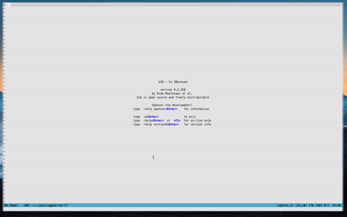

# vim-lf: lf integration for Vim 8.2

## Why?
Sometimes I need to visually browse through the folder hierarchy to find the file I'm looking for.
In the shell, I use [lf](https://github.com/gokcehan/lf) as a terminal file manager, so I have lots of aliases and commands set up in lf.
In Vim, I generally use netrw or [fzf](https://github.com/junegunn/fzf) to select files, but from time to time I wanted to browse or select files in lf, especially since I also have [rupa/z](https://github.com/rupa/z) integrated into lf.

I initially looked at [ptzz/lf.vim](https://github.com/ptzz/lf.vim), but I did not like that it used a hard-coded file path to store the selected file instead of Vim's `tempname()`.
I also didn't like its configuration style, which is based on global variables.
I considered the original [lf.vim plugin](https://github.com/gokcehan/lf/blob/master/etc/lf.vim), which had the right idea.
However, both plugins run `lf` as a shell command, and I wanted to make use of Vim's popups.
So I made this plugin.

## What?
This plugin integrates lf into Vim, so you need to have lf installed.
It uses a terminal popup window to display the file manager.
This plugin only supports Vim 8.2 and higher, as it requires the popup window features.
There is some code included for Neovim support, which is taken from [ptzz/lf.vim](https://github.com/ptzz/lf.vim), but I cannot guarantee that this will always work everywhere, as I don't use Neovim.

The plugin exposes two normal mode mappings:

* `<Plug>LfEdit`: open lf in a popup window; the `open` command in lf will `:edit` each of the selected files in Vim.
* `<Plug>LfSplit`: open lf in a popup window; the `open` command in lf will `:split` each of the selected files in Vim.

There are no default mappings (by design, so as not to force mappings on users), so you need to map these `<Plug>`s yourself.

**Disclaimer:** this code is not extensively tested.
It works for me, running Vim 8.2 in the terminal on macOS, but it's not guaranteed to work for others.
It might not work in Neovim, as I don't use Neovim.

## Acknowledgements
Inspired by [ptzz/lf.vim](https://github.com/ptzz/lf.vim) and lf's [Vim plugin](https://github.com/gokcehan/lf/blob/master/etc/lf.vim).
